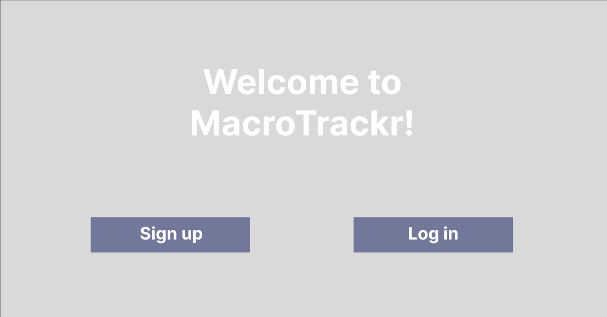
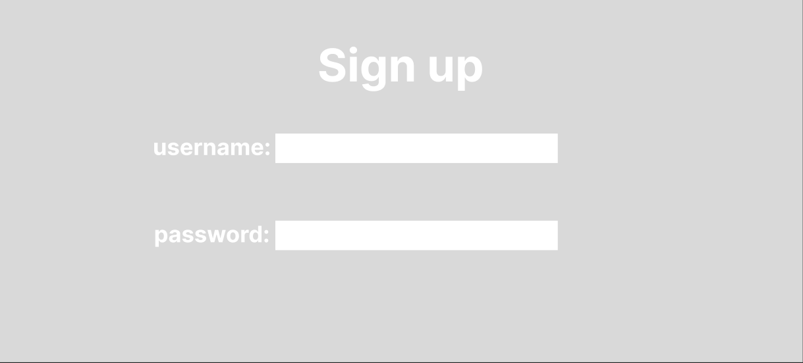
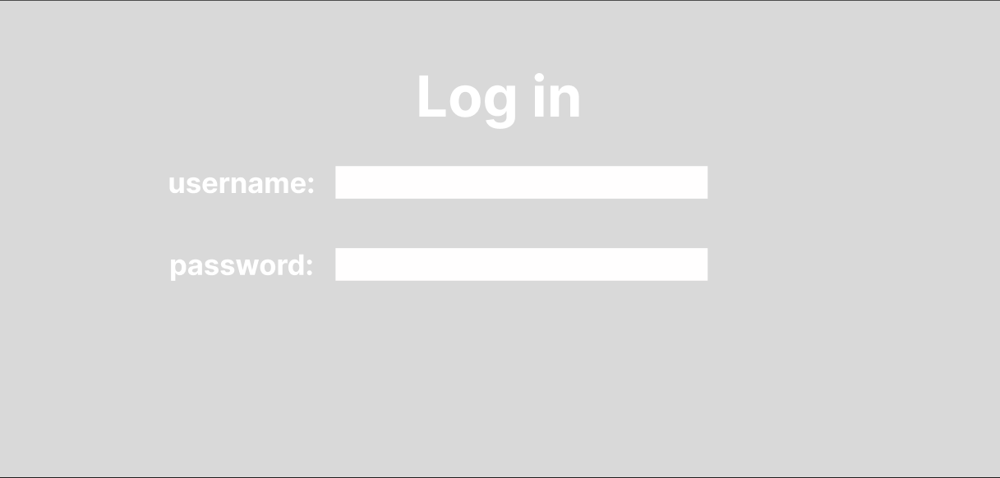
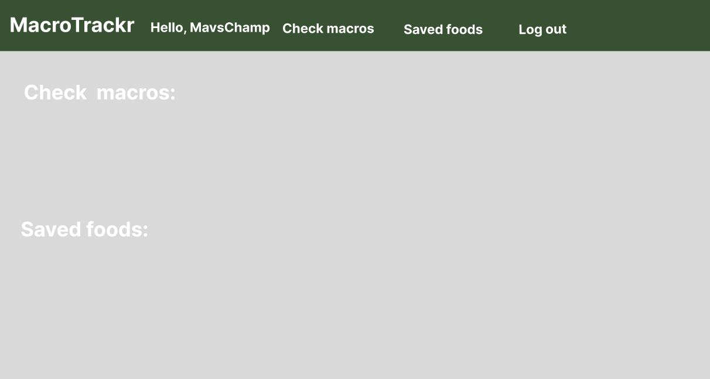
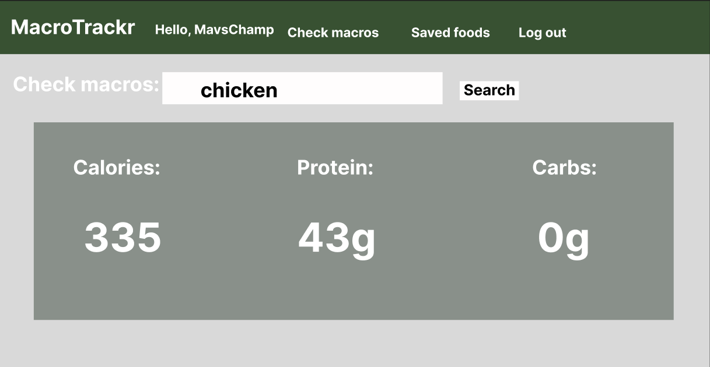
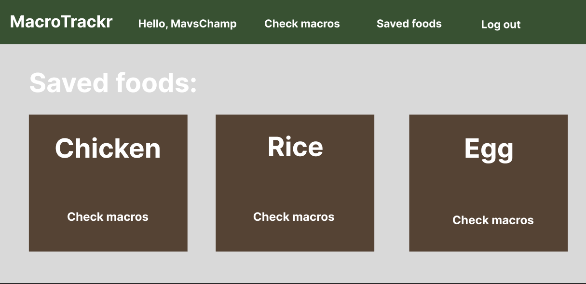
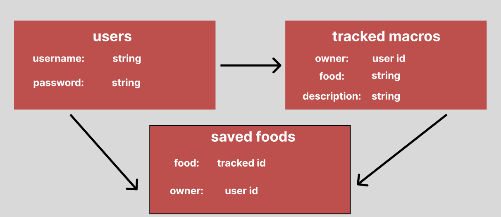

# MacroTrackr_api

## Overview
My application is called MacroTrackr. It's an app used to count and track macros and save different food items. Users will sign up and create an account to access the features, using a username and password.

## Wireframes / Screenshots

## Entity Relationship Diagrams
